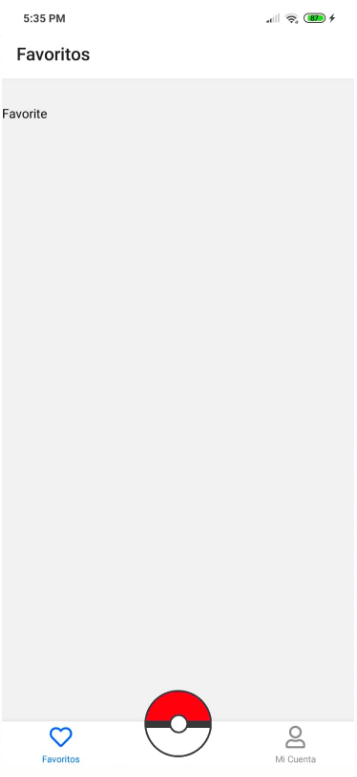
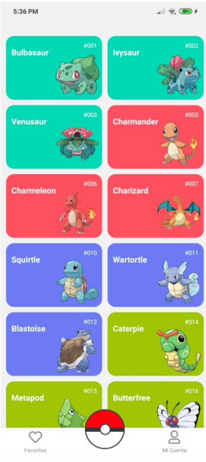
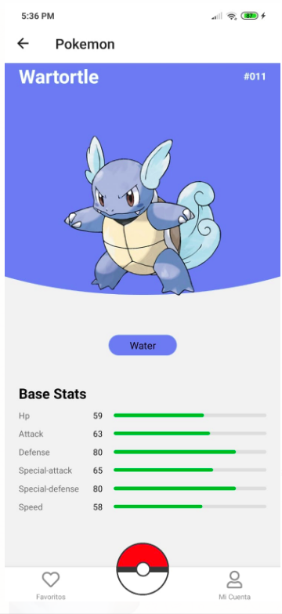

# pokedex

In the project directory, you can run:

git clone https://github.com/Garymarena/pokedex.git

cd pokedex

npm install --global expo-cli

yarn dev

yarn start

# Screenshots

# Rules

a) Crear una aplicación con React Native que use la API para crear un “Pokedex” al estilo Pokemon
API
https://pokeapi.co/
Requisitos mínimos:

- Consumir más de 3 acciones, por ejemplo: habilidades, evoluciones, etc.
- Tener una interfaz gráfica para poder interactuar con los Pokémon.
- Que se pueda ejecutar en un emulador y comandos necesarios.
- Seguir los principios de SOLID, CLEAN CODE.
- Agregar pruebas unitarias.
- Énfasis en una interfaz atractiva y con un buen UX.
- Subir la prueba a un repositorio.
- Compartir link al repositorio (para revisar el código) e incluir best practices para realizar el test
